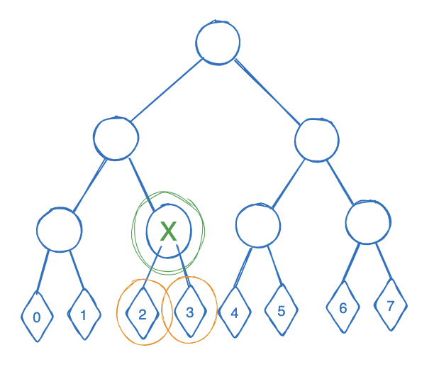

# How to create a recursive proof in Plonky2

## Walkthrough of merkle_proof_example2 (recursive proof example)

### High level overview
A merkle proof is proven recursively. 

In the initial step the 2 hashes of the leaves are the input, and the hash of those is checked to be equal to the Merkle digest which is public input.  

<p float="left">
  
   
</p>

In the recursive step, the proof of the previous step is used in the circuit, as well as the hash on the other side and once again the expected result (Merkle digest) is the public input. 
<p float="left">
  
   
</p>

This recursive pattern is repeated until all levels have been traversed and a single proof that verifies the total merkle proof is the result. 

### Details: initial_proof_circuit

```rust
  let mut w_targets: Vec<HashOutTarget> = Vec::new();
```
This vector will keep track of the targets that should be added to the witness. 

```rust
  let config = CircuitConfig::standard_recursion_config();
  let mut builder: CircuitBuilder<plonky2::field::goldilocks_field::GoldilocksField, 2> = CircuitBuilder::<F, D>::new(config);

  let left_hash_target = builder.add_virtual_hash();
  let right_hash_target = builder.add_virtual_hash();
  w_targets.push(left_hash_target);
  w_targets.push(right_hash_target);
```

The circuit data is created using the builder. It is intentional to only create the circuit here, and not yet the witness - to see clearly where lies what role and at what step what needs to happen. 

The left and right hash are "added" as virtual hashes to the builder, which means they're expected to be input from somewhere - in this case the witness. (Can also be public input or connected to some other wires in a recursive step.)

We also add those to the vector `w_targets` so they can be filled in the witness when being used.

```rust
  let merkle_digest_target = builder.hash_or_noop::<PoseidonHashConfig, PoseidonHash>([
    left_hash_target.elements.to_vec(), 
    right_hash_target.elements.to_vec()
  ].concat());

  // Register the digest of the 2 leafs as public input
  builder.register_public_inputs(&merkle_digest_target.elements);
```

The hash of the 2 input hashes is registered as public input. We don't have to add this to `w_targets` because it can be extracted from the circuit data directly. 

```rust
  (builder.build::<C>(), w_targets)
```
Returning both the circuit data and the elements that have to be added to the witness (tracked in `w_targets`). 

### Details: recursive_step

Recall that for this step we have the following flow:
<p></p>

Thus, inputs are a previous proof and a next hash. As public input (and thus the desired outcome) we have the Merkle digest. 

```rust
  let config = CircuitConfig::standard_recursion_config();
  let mut builder: CircuitBuilder<plonky2::field::goldilocks_field::GoldilocksField, 2> = CircuitBuilder::<F, D>::new(config);

  let input_hash = builder.add_virtual_hash();
```

The input_hash that is registered with the builder will be connected to the "output" of the proof of the previous step. This is the Merkle digest of the previous step. 


```rust
  let prev_proof_target = 
    builder.add_virtual_proof_with_pis(&previous_proof_circuit_data_common);
    
  let prev_proof_verifier_data = 
    builder.add_virtual_verifier_data(previous_proof_circuit_data_common.config.fri_config.cap_height);
```
Here, the proof and verifier_data of the previous proof are added to the builder. These need to be set in the witness for the current ciruit and the references therefore will be returned at the end of the function.

```rust
  input_hash.elements.iter()
  .zip(&prev_proof_target.public_inputs[0..4])
  .for_each(|(e1, e2)| {
    builder.connect(*e1, *e2);
  });
```
The `input_hash` that was defined before gets connected to the public input of the previous proof. It iterated over 4 elements because the fash consists of 4 field elements. 

```rust
  builder.verify_proof::<PoseidonGoldilocksConfig>(
    &prev_proof_target, 
    &prev_proof_verifier_data, 
    &previous_proof_circuit_data_common);

```
In the current proof, the previous proof gets verified. 

```rust
  let mut targets: Vec<HashOutTarget> = Vec::new();

  if sibling_right_side {
    // Add target for sibling hash (that's on the right)
    let right_hash_target = builder.add_virtual_hash();
    targets.push(right_hash_target);
    let merkle_digest_target = builder.hash_or_noop::<PoseidonHashConfig, PoseidonHash>([
      input_hash.elements.to_vec(), 
      right_hash_target.elements.to_vec()
    ].concat());
    // Add target for merkle digest of this level to public inputs
    builder.register_public_inputs(&merkle_digest_target.elements);
  } else {
    // Add target for sibling hash (that's on the left)
    let left_hash_target = builder.add_virtual_hash();
    targets.push(left_hash_target);
    let merkle_digest_target = builder.hash_or_noop::<PoseidonHashConfig, PoseidonHash>([
      left_hash_target.elements.to_vec(),
      input_hash.elements.to_vec()
    ].concat());
    // Add target for merkle digest of this level to public inputs
    builder.register_public_inputs(&merkle_digest_target.elements);
  }
```
As part of the inputs the boolean `sibling_right_side` has to be passed in. This tells us whether the "new" hash that is added is on the right side or not. The previous proof automatically is on the opposite side. This is needed to create the next hash (merkle digest) correctly. 

Let's assume `sibling_right_side = true`, then we have the following steps:

```rust
    // Add target for sibling hash (that's on the right)
    let right_hash_target = builder.add_virtual_hash();
    targets.push(right_hash_target);
    let merkle_digest_target = builder.hash_or_noop::<PoseidonHashConfig, PoseidonHash>([
      input_hash.elements.to_vec(), 
      right_hash_target.elements.to_vec()
    ].concat());
    // Add target for merkle digest of this level to public inputs
    builder.register_public_inputs(&merkle_digest_target.elements);
```

The hash that will be input to the circuit is added as a virtual hash (sort of placeholder) and also pushed to the targets that need to be filled by the witness for this circuit. 

Then the next hash is calculated and registered as public inputs. These steps look similar as to what we did in the initial step, the only difference is that one of the input hashes is connected to the previous proof. 

Finally:
```rust
  (builder.build::<C>(), prev_proof_target, prev_proof_verifier_data, targets)
```
 The following is returned:
 - circuit data
 - reference to set the previous proof in the witness 
 - reference to set the previous verifier data in the witness
 - reference to set the other input hash in the witness (this is in `targets`)

### Details: verify_merkle_proof_circuit_and_proof

This is the function that ties everything together and does a full verification of a merkle proof in a recursive manner. Instead of verifying the merkle proof in 1 circuit, the verification is done step by step in separate proofs that are recursively being tied together, resulting into 1 final proof.

Note the following input values: 

```rust
  leaf_index: usize, 
  leaf_value: HashOut<GoldilocksField>,
  merkle_proof: Vec<HashOut<GoldilocksField>>,
  in_between_hashes: Vec<HashOut<GoldilocksField>>
```

The `leaf_index` is needed to know at what side the input hashes are expected to be. For example if the leaf has index 3, it is at the right side of a leaf pair. In general, all even leaves (or rather, leaves with even index) are on the left and all the odd ones on the right. 

The `leaf_value` is the actual (hash) value of the leaf we're trying to proof is part of the Merkle tree. 

The `merkle_proof` is what we're using together with `in_between_hashes` to verify the leaf is indeed part of the Merkle tree. Normally, the `in_between_hashes` would not be included in a Merkle proof, but in this implementation it is needed (TODO improve on this!). For every step of the recursive proof the check is that the hash of 2 input hashes is equal to the next hash, and for that the next hash has to be provided (these are the values in `in_between_hashes`).


```rust
  let (initial_circuit_data, initial_targets) = 
    initial_proof_circuit();
  let initial_circuit_verifier_data = 
    initial_circuit_data.verifier_only.clone();
```
The first step is to create the initial circuit for the leaf and sibling. Recall that for the recursive step we need both the circuit data as the verifier data, so this is stored in a separate variable.

```rust
  let mut pw = plonky2::iop::witness::PartialWitness::new();
  let mut current_leaf_index = leaf_index;
  if current_leaf_index % 2 == 0 {
    pw.set_hash_target(initial_targets[0], leaf_value);
    pw.set_hash_target(initial_targets[1], merkle_proof[0]);
  } else {
    pw.set_hash_target(initial_targets[0], merkle_proof[0]);
    pw.set_hash_target(initial_targets[1], leaf_value);
  }
```

Next, a witness is created which will be filled to be able to create a proof for the initial circuit. First, the right and left hash are added according to their positions. 

```rust
  current_leaf_index = current_leaf_index/2;
  let expected_public_inputs = initial_circuit_data.prover_only.public_inputs.clone();
  for i in 0..4 {
    pw.set_target(expected_public_inputs[i], in_between_hashes[0].elements[i]);
  }
```
Then the expected hash output (the Merkle digest of that location in the Merkle tree) is added as public input. This is the reason why the `in_between_hashes` are necessary, so every proof only gets verified if it indeed leads to the correct Merkle digest.

```rust
  let mut prev_circuit_data_common = initial_circuit_data.common.clone();
  let mut prev_proof = initial_circuit_data.prove(pw).unwrap();
  let mut prev_verifier_data = initial_circuit_verifier_data;
```
Preparing for the interation, these variables are set up mutable and with an initial value of the inital circuit so they can be reused over and over again adding a "previous proof" to the "current proof".


```rust
  let mut final_circuit = initial_circuit_data; 
```

Also, the final product we are returning is the complete circuit data, and we're keeping track of it like this. 

TODO: find a cleaner way to do this

Now, for each of the remaining layers in the Merkle proof, a new proof is created which incorporates the previous proof and checks the next has. 

```rust
  let mut current_pw = plonky2::iop::witness::PartialWitness::new();
```
Each new step requires a witness to be filled, because we actually need to create a proof. That proof is then used and included in the next step. 

```rust
  let siblings_right_side = current_leaf_index % 2 == 0;
```
Depending on the path of the Merkle proof through the tree, at each step the side of the new hash can be different and has to be determined. 

```rust
  let (next_circuit_data, 
      prev_proof_target, 
      v_data_target, 
      new_targets) = recursive_step(prev_circuit_data_common, siblings_right_side);
```
See the previous sections for more explanation on what the recursive step does. 

```rust
  current_pw.set_hash_target(new_targets[0], merkle_proof[i]);
  current_pw.set_proof_with_pis_target(&prev_proof_target, &prev_proof);
  current_pw.set_verifier_data_target(
    &v_data_target,
    &prev_verifier_data,
  );

  // Public input for this step
  let expected_public_inputs = next_circuit_data.prover_only.public_inputs.clone();
  for j in 0..4 {
    current_pw.set_target(expected_public_inputs[j], in_between_hashes[i].elements[j]);
  }
```
Next, all necessary targets in the witness are set; hash input, previous proof, previous verifier data and finally the expected hash output for this step in the public input. Once again, for this final step we're leveraging the information in `in_between_hashes`. 

```rust
  // Update values for next iteration
  prev_circuit_data_common = next_circuit_data.common.clone();
  prev_proof = next_circuit_data.prove(current_pw).unwrap(); // Current step gets proven to be incorporated in next step
  prev_verifier_data = next_circuit_data.verifier_only.clone();
  // Get ready for next layer
  current_leaf_index = current_leaf_index/2;

  final_circuit = next_circuit_data;
```

Updating all the values for the next iteration of recursion.

This repeats until the root is reached. 

```rust
  (final_circuit, prev_proof)
```

Finally the output of this function is the circuit that recursively "contains" all previous steps and the (last) proof. The proof can be verified on the circuit data.

The end!

### Testing

For all 3 functions tests have been added. Both passing and failing testcases, to make sure correct Merkle proof should be able to provide a proof and also that any incorrect data/proof should lead to an error.