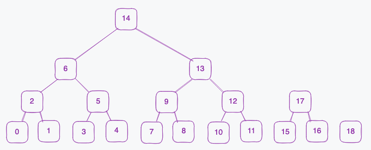
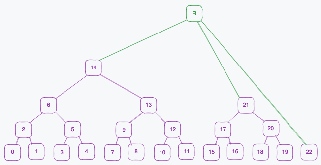

# Merkle Mountain Ranges implementation notes

Merkle Mountain Ranges (MMR) were proposed by Peter Todd. The introduction can be found [here](https://github.com/opentimestamps/opentimestamps-server/blob/master/doc/merkle-mountain-range.md).

## Short description

An MMR is a tree that consists of multiple sub-trees next to each other. The largest tree is always on left and the smallest on the right. 

The tree is mutable; leaves can be appended continuously. With new leaves being added, they can complete next trees which can in turn grow large enough to complete even larger trees together with previous subtrees.

Example of MMR with size 19, the numbering indicates the order in which the elements were added:

  
  
Figure 1. An example of Merkle Mountain Ranges.

When the next leaf is added to the example tree of size 19, this trigger completing a small Merkle tree of 3 elements. Then we have 2 Merkle trees of the same height (1) next to each other, therefore they are connected into a larger Merkle tree of height 2. 

   
  
Figure 2. A leaf is added.

The next leaf that is added doesn't complete any tree, so no further action is taken.

   
  
Figure 3. Another leaf is added.

The structure of the MMR can be represented in an array, representing the heights of the elements. For example 
`00100120010012340010`
represents the MMR of Figure 1. 

### Peaks

Every root (/top) of a sub tree is a peak within the MMR. 

When the MMR is a perfect binary tree, there is a single root. 

   
    
Figure 4. Peaks of an MMR.

### Bagging the peaks

To get a single root for the MMR, all peaks are hashed together. This process is called "bagging the peaks".

   
  
Figure 5. Result of bagging the peaks of an MMR.

### "MMR proof"

A proof for this type of tree consists of the following:
1. A Merkle proof for the leaf w.r.t its subtree
2. A list of all the peaks in the MMR

A proof is valid if:
- The (subtree) Merkle proof checks out
- The resulting hash of the Merkle proof is contained in the list of peaks
- Hashing the peaks together leads to MMR root

## Implementation

### MMR implementations
There are 2 versions of MMR implemented: a naive version and an optimized version. 

The "naive" version keeps track of the elements, heights of all elements, the peaks, the number of leaves and the maximum height reached in the tree.

The optimized version only holds an (ordered) array of elements of the MMR and the rest is calculated on the go.

### MMR proof verifiers

Both implementations have the option to generate a proof. Plonky2 verifiers have been added, both with and without recursion. In the recursive verifier the proof of verification of subtree Merkle tree is embedded, before doing the check of hashing together all peaks and comparing it to the root.